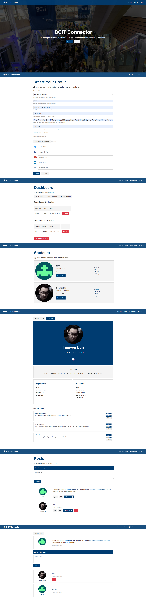

# Quick Start 🚀

### Replace mongoURI, githubClientId, githubSecret in `config/default.json`

### Install server dependencies

```
$ npm install
```

### Install client dependencies

```
$ cd client
$ npm install
```

### Run both Express & React from root

```
$ npm run dev
```

### Screenshots


